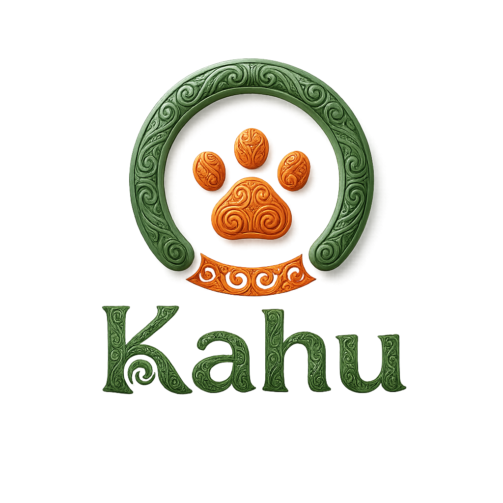

Kahu es una app web fullstack para dueños de perros que siguen dieta BARF o dieta casera cocinada. El usuario registra su mascota y chatea con un agente IA que calcula recetas y porciones personalizadas según peso, raza, edad, alergias, tipo de dieta y número de tomas al día.

---

## Stack

**Frontend** — React 18 + Vite + React Router v6, Context API, CSS Modules, diseño mobile-first

**Backend Node** — Node.js + Express, Prisma ORM, PostgreSQL, JWT, bcrypt, express-validator

**Backend IA** — FastAPI + LangGraph + LangChain, RAG con ChromaDB, Groq (llama-3.3-70b-versatile), FastEmbed

**Automatización** — N8N (workflow PDF + email al generar un plan nutricional)

**Deploy** — Vercel (frontend) + Render (backends) + Neon (PostgreSQL en cloud)

---

## Arquitectura

```
┌─────────────┐     ┌─────────────────┐     ┌──────────────────┐
│   Frontend  │────▶│  Backend Node   │────▶│   PostgreSQL     │
│  React+Vite │     │  Express+Prisma │     │   (Neon/Local)   │
└──────┬──────┘     └─────────────────┘     └──────────────────┘
       │
       │            ┌─────────────────┐     ┌──────────────────┐
       └───────────▶│  Backend IA     │────▶│   ChromaDB       │
                    │  FastAPI +      │     │   (vectorstore)  │
                    │  LangGraph+RAG  │     └──────────────────┘
                    └────────┬────────┘
                             │
                    ┌────────▼────────┐
                    │   Groq API      │
                    │ llama-3.3-70b   │
                    └─────────────────┘
```

---

## Estructura del proyecto

```
kahu-app/
├── backend-ai/          FastAPI + LangGraph + RAG
│   ├── app/
│   │   ├── agent/       Grafo LangGraph, tools, prompts
│   │   ├── rag/         ChromaDB, loaders, embeddings
│   │   └── api/         Endpoints FastAPI
│   ├── docs/            5 documentos RAG indexados
│   └── ingest.py        Script de indexación (ejecutar una vez)
├── backend-node/        Node.js + Prisma + JWT
│   ├── src/
│   │   ├── controllers/
│   │   ├── routes/
│   │   ├── middleware/
│   │   └── schemas/
│   └── prisma/
│       ├── schema.prisma
│       ├── migrations/
│       └── seed.js
├── frontend/            React 18 + Vite
│   └── src/
│       ├── components/
│       ├── context/
│       ├── hooks/
│       ├── pages/
│       └── services/
├── n8n/                 Workflow exportado PDF + Email
├── API.md               Documentación de endpoints
└── kahu-api.postman_collection.json
```

---

## Instalación

### Requisitos previos
- Node.js 18+
- Python 3.11+
- PostgreSQL corriendo en local

### Backend Node

```bash
cd backend-node
npm install
cp .env.example .env
# Rellena las variables de entorno
npx prisma migrate dev
npx prisma db seed
npm run dev
```

La API estará disponible en `http://localhost:3001`.

### Backend IA

```bash
cd backend-ai
python3 -m venv .venv
source .venv/bin/activate
pip install -r requirements.txt
cp .env.example .env
# Rellena las variables de entorno con tu GROQ_API_KEY
python ingest.py   # Solo la primera vez — indexa los documentos RAG
uvicorn app.main:app --reload --port 8000
```

El servidor IA estará disponible en `http://localhost:8000`.

### Frontend

```bash
cd frontend
npm install
cp .env.example .env
# Rellena las variables de entorno
npm run dev
```

La app estará disponible en `http://localhost:5173`.

> Asegúrate de tener los tres servidores corriendo para que la app funcione completa.

---

## Variables de entorno

Las variables necesarias están documentadas en los archivos `.env.example` de cada carpeta. Cópialos y rellena con tus credenciales reales.

| Carpeta | Variables principales |
|---------|----------------------|
| `backend-node` | `DATABASE_URL`, `JWT_SECRET`, `INTERNAL_SERVICE_TOKEN` |
| `backend-ai` | `GROQ_API_KEY`, `NODE_BACKEND_URL`, `INTERNAL_SERVICE_TOKEN` |
| `frontend` | `VITE_API_NODE_URL`, `VITE_API_AI_URL` |

---

## API — Recursos principales

| Recurso | Ruta base | Backend |
|---------|-----------|---------|
| Auth | `/api/auth` | Node |
| Mascotas | `/api/mascotas` | Node |
| Planes nutricionales | `/api/planes` | Node |
| Historial veterinario | `/api/historial-vet` | Node |
| Chat historial | `/api/chat` | Node |
| Registro de peso | `/api/peso` | Node |
| Chat con agente IA | `/api/chat` | FastAPI |

Todos los endpoints de Node (excepto `/api/auth/register` y `/api/auth/login`) requieren token JWT en el header `Authorization: Bearer <token>`.

Ver `API.md` para documentación completa y `kahu-api.postman_collection.json` para importar en Postman.

---

## Base de datos

7 tablas relacionadas:

- **Usuario** — perfil, credenciales, ciudad, rol (USER / ADMIN)
- **Mascota** — datos del perro (raza, peso, edad, alergias, tipo de dieta, tomas)
- **PlanNutricional** — planes generados por el agente IA
- **HistorialVeterinario** — visitas veterinarias (fecha, motivo, descripción, próxima cita)
- **ChatHistorial** — historial de conversaciones con el agente por mascota
- **RegistroPeso** — evolución del peso a lo largo del tiempo
- **Tratamiento** — tratamientos recurrentes (vacunas, antiparasitarios, medicamentos) con frecuencia en días, última dosis y próxima dosis calculada automáticamente

---

## Agente IA

El agente usa **LangGraph** con RAG sobre 5 documentos especializados en nutrición canina:

1. Tabla maestra de alimentos permitidos y prohibidos
2. Cálculo de porciones y raciones BARF
3. Guía completa BARF vs dieta cocinada
4. Cuidados por etapa de vida (cachorro, adulto, senior)
5. Adiestramiento en positivo

### Tools disponibles
- `registrar_receta` → guarda el plan en `PlanNutricional`
- `actualizar_registro_vet` → guarda eventos en `HistorialVeterinario`

---

## Roles

**USER** — puede registrar mascotas, chatear con el agente IA, ver y eliminar sus planes nutricionales, registrar el peso de su mascota y gestionar el historial veterinario.

**ADMIN** — acceso completo. Puede gestionar todos los usuarios y recursos de la plataforma.

---

## Funcionalidades

- Registro, login y logout con JWT
- Soporte multi-mascota — varias mascotas por usuario, cambio de activa desde el home
- Perfil de mascota editable (raza, peso, edad, alergias, tipo de dieta, tomas al día)
- Chat con agente IA especializado en nutrición canina BARF y cocinada
- El agente muestra el plan antes de guardarlo y pide confirmación
- Historial de chat persistido en PostgreSQL por mascota
- Planes nutricionales guardados con calorías, ingredientes y proporciones
- Descarga del plan nutricional por email vía workflow N8N
- Gráfico de evolución de peso con registro histórico
- Historial veterinario con UI completa — registro de visitas, motivo, descripción y próxima cita
- Gestión de tratamientos recurrentes (vacunas, antiparasitarios, medicamentos) con cálculo automático de próxima dosis
- Alertas de tratamientos atrasados o próximos directamente en el home
- Alerta meteorológica en tiempo real según la ciudad del usuario (OpenWeatherMap) con niveles de riesgo para el paseo
- Soporte bilingüe (español / inglés)
- Diseño mobile-first con navbar flotante
- Rate limiting en endpoints de autenticación (10 intentos / 15 min)
- Manejo centralizado de errores en ambos backends
- Validaciones en cliente (React) y servidor (express-validator + Pydantic v2)

---

## Arrancar la app en local

Necesitas tres terminales abiertas:

**Terminal 1 — Backend Node:**
```bash
cd backend-node && npm run dev
```

**Terminal 2 — Backend IA:**
```bash
cd backend-ai && source .venv/bin/activate && uvicorn app.main:app --reload --port 8000
```

**Terminal 3 — Frontend:**
```bash
cd frontend && npm run dev
```

---

## Usuarios de prueba (seed)

| Nombre | Email | Password | Rol |
|--------|-------|----------|-----|
| KahuAdmin | admin@kahu.com | admin123 | ADMIN |
| Patricia | patricia@test.com | test123 | USER |
| Carlos | carlos@test.com | test123 | USER |
| Ana | ana@test.com | test123 | USER |
| Miguel | miguel@test.com | test123 | USER |
| Sara | sara@test.com | test123 | USER |

Mascotas de prueba con IDs `seed-mascota-0001` a `seed-mascota-0005` vinculadas a cada usuario.

---

## Deploy

- Frontend → https://kahu-app-brown.vercel.app
- Backend Node → https://kahu-backend-node.onrender.com
- Backend IA → https://kahu-backend-ai.onrender.com
- Base de datos → PostgreSQL en Neon (Frankfurt)

---

## Backlog

- Migrar autenticación a httpOnly cookies (mejora de seguridad: elimina el riesgo de robo de token vía XSS en localStorage)
- Chat diferenciado: un agente para nutrición y otro para cuidados y adiestramiento
- Actualización de ciudad en el perfil del usuario (para la alerta meteorológica)
- Modo offline con PWA
- Vectorstore en Qdrant cloud para mejor escalabilidad
- Notificaciones en tiempo real
- Dashboard de administración
- Recuperación de contraseña por email
- Token refresh automático (actualmente el JWT expira a los 7 días y requiere nuevo login)

